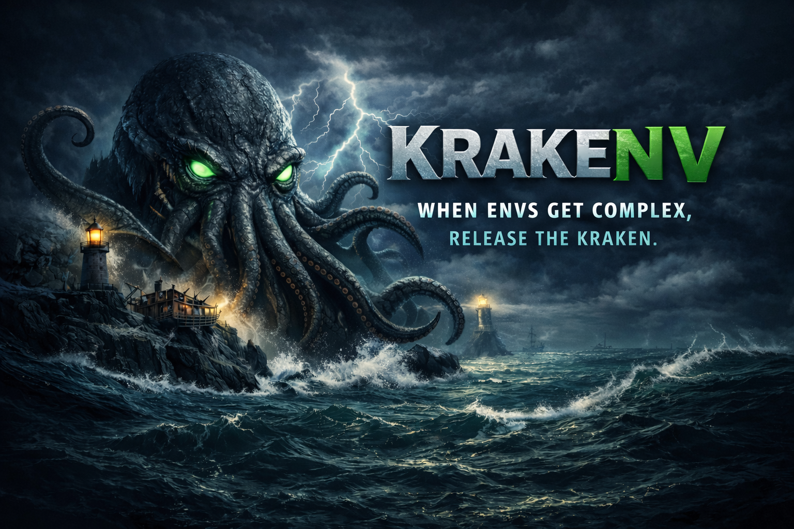

<p align="center">
  
</p>

<p align="center">
  <a href="https://github.com/theburrowhub/krakenv/releases"></a>
  <a href="https://github.com/theburrowhub/krakenv/actions"></a>
  <a href="https://goreportcard.com/report/github.com/theburrowhub/krakenv"></a>
  <a href="LICENSE"></a>
</p>

<p align="center">
  <strong>Environment variable management with annotation-based wizards</strong>
</p>

---

Krakenv is a CLI tool for managing environment variable files (`.env`) with an annotation-based configuration wizard system. It transforms the tedious process of configuring environment files into a guided, validated experience.

## ✨ Features

- **Interactive Wizard**: Guided configuration with type validation and constraints
- **Annotation System**: Define prompts, types, and validation rules inline in your `.env.dist`
- **Multi-Environment Support**: Generate `.env.local`, `.env.testing`, `.env.production` from a single template
- **Validation**: Type checking (int, string, enum, boolean, object) with constraints (min, max, pattern, etc.)
- **Inspection**: Compare distributable and environment files, sync discrepancies
- **CI/CD Ready**: Non-interactive mode with exit codes for pipeline integration
- **Google Cloud Secret Manager**: Fetch secret values automatically from GCP Secret Manager
- **Cross-Platform**: Runs on Linux, macOS, and Windows

## 📦 Installation

### Quick Install (Linux/macOS)

```bash
curl -sSL https://raw.githubusercontent.com/theburrowhub/krakenv/main/install.sh | bash
```

### Homebrew (macOS/Linux)

```bash
brew install theburrowhub/tap/krakenv
```

### Go Install

```bash
go install github.com/theburrowhub/krakenv/cmd/krakenv@latest
```

### Binary Downloads

Download pre-built binaries from the [Releases](https://github.com/theburrowhub/krakenv/releases) page.

## 🚀 Quick Start

### 1. Create a Distributable Template

Create a `.env.dist` file with annotations:

```env
#krakenv:environments=local,testing,production

# Database Configuration
DB_HOST=localhost #prompt:Database host?|string
DB_PORT=5432 #prompt:Database port?|int;min:1;max:65535
DB_NAME= #prompt:Database name?|string;minlen:1
DB_PASSWORD= #prompt:Database password?|string;secret

# Application Settings
APP_ENV=development #prompt:Environment?|enum;options:development,staging,production
DEBUG=true #prompt:Enable debug mode?|boolean;optional
WORKERS=4 #prompt:Number of workers?|int;min:1;max:16
```

### 2. Generate Environment File

```bash
krakenv generate .env.local
```

The wizard will prompt you for each undefined or invalid variable.

### 3. Validate Configuration

```bash
krakenv validate .env.local
```

### 4. Inspect Discrepancies

```bash
krakenv inspect .env.local
```

## 📖 Annotation Syntax

```
VARIABLE=default #prompt:Question?|type;constraint:value;modifier
```

### Supported Types

| Type | Description | Example |
|------|-------------|---------|
| `string` | Text value | `#prompt:Name?\|string;minlen:1;maxlen:100` |
| `int` | Integer | `#prompt:Port?\|int;min:1;max:65535` |
| `numeric` | Float/decimal | `#prompt:Rate?\|numeric;min:0;max:1` |
| `boolean` | true/false | `#prompt:Enable?\|boolean` |
| `enum` | One of options | `#prompt:Env?\|enum;options:dev,staging,prod` |
| `object` | JSON/YAML | `#prompt:Config?\|object;format:json` |

### Constraints

| Constraint | Applies To | Description |
|------------|------------|-------------|
| `min` | int, numeric | Minimum value |
| `max` | int, numeric | Maximum value |
| `minlen` | string | Minimum length |
| `maxlen` | string | Maximum length |
| `pattern` | string | Regex pattern |
| `options` | enum | Allowed values |
| `format` | object | `json` or `yaml` |
| `gcp-secret` | any | Fetch value from GCP Secret Manager |

### Modifiers

| Modifier | Description |
|----------|-------------|
| `optional` | Variable can be empty |
| `secret` | Hide input in wizard |

## 🔧 Commands

```bash
krakenv generate <target>   # Generate environment file from distributable
krakenv validate <target>   # Validate environment file against annotations
krakenv inspect <target>    # Compare distributable and environment files
krakenv add <name>          # Add new annotated variable to distributable
krakenv init                # Initialize new distributable with wizard
krakenv version             # Show version information
```

### Global Flags

| Flag | Description |
|------|-------------|
| `--dist, -d` | Path to distributable file (default: `.env.dist`) |
| `--non-interactive, -n` | Disable TUI; fail on unresolved variables |
| `--quiet, -q` | Suppress non-error output |
| `--verbose, -v` | Enable detailed output |

## 🔐 Google Cloud Secret Manager

Krakenv can automatically fetch secret values from [GCP Secret Manager](https://cloud.google.com/secret-manager), eliminating the need to manually enter sensitive values during generation.

The `.env.dist` is the **single source of truth**. Each `gcp-secret` variable
declares its project, name, and version as explicit, named fields — no flags or
environment variables are needed. A single template can pull secrets from
**different GCP projects**.

### Annotation fields

| Field | Required | Description |
|-------|----------|-------------|
| `gcp-secret` | yes | Modifier — marks the variable as GCP-sourced |
| `gcp-secret-project:PROJECT` | yes | GCP project ID |
| `gcp-secret-name:NAME` | yes | Secret name in Secret Manager |
| `gcp-secret-version:VERSION` | no | Version number (default: `latest`) |

Version accepts both numeric (`3`) and v-prefixed (`v3`) notation.

```env
#krakenv:environments=local,production

# Secrets from different GCP projects — each annotation is self-contained
API_KEY=      #prompt:API Key?|string;secret;gcp-secret;gcp-secret-project:payments-project;gcp-secret-name:stripe-key;gcp-secret-version:v2
DB_PASSWORD=  #prompt:DB Password?|string;secret;gcp-secret;gcp-secret-project:infra-project;gcp-secret-name:db-password
JWT_SECRET=   #prompt:JWT Secret?|string;secret;gcp-secret;gcp-secret-project:auth-project;gcp-secret-name:jwt-secret;gcp-secret-version:3
```

### Usage

```bash
# No flags needed — all information is in the .env.dist
krakenv generate .env.local

# Works in non-interactive mode (fully automated CI/CD)
krakenv generate .env.production --non-interactive

# Verbose output shows how many secrets were resolved
krakenv generate .env.local --verbose
```

### Authentication

Krakenv uses **Application Default Credentials (ADC)**. Configure one of:

| Method | Command |
|--------|---------|
| gcloud CLI | `gcloud auth application-default login` |
| Service account key | `export GOOGLE_APPLICATION_CREDENTIALS=/path/to/key.json` |
| GCP-hosted environment | Automatic (GCE, Cloud Run, GKE, etc.) |

### CI/CD with Workload Identity

```yaml
# GitHub Actions with Workload Identity Federation
- name: Authenticate to GCP
  uses: google-github-actions/auth@v2
  with:
    workload_identity_provider: 'projects/123/locations/global/workloadIdentityPools/...'
    service_account: 'krakenv@my-project.iam.gserviceaccount.com'

- name: Generate environment
  run: krakenv generate .env.production --non-interactive
```

### Required IAM Role

The authenticated principal needs `roles/secretmanager.secretAccessor` on each secret.

```bash
gcloud secrets add-iam-policy-binding my-api-key \
  --project my-project \
  --member="serviceAccount:krakenv@my-project.iam.gserviceaccount.com" \
  --role="roles/secretmanager.secretAccessor"
```

## 🔄 CI/CD Integration

### Pre-commit Hook

```bash
#!/bin/bash
krakenv validate .env.local --non-interactive || exit 1
```

### GitHub Actions

```yaml
- name: Validate environment
  run: krakenv validate .env.production --non-interactive
```

### Makefile

```makefile
env-setup:
	krakenv generate .env.local

env-validate:
	krakenv validate .env.local --non-interactive
```

## 🏗️ Development

```bash
# Clone repository
git clone https://github.com/theburrowhub/krakenv.git
cd krakenv

# Install dependencies
make deps

# Run tests
make test

# Build binary
make build

# Run linter
make lint

# Run all checks
make check
```

## 📄 License

MIT License - see [LICENSE](LICENSE) for details.

## 🤝 Contributing

Contributions are welcome! Please read our contributing guidelines before submitting a PR.

1. Fork the repository
2. Create your feature branch (`git checkout -b feature/amazing-feature`)
3. Commit your changes (`git commit -m 'Add amazing feature'`)
4. Push to the branch (`git push origin feature/amazing-feature`)
5. Open a Pull Request

---

<p align="center">
  <strong>Built with 💜 by <a href="https://github.com/theburrowhub">The Burrow Hub</a></strong>
  <br>
  <em>Crafting effective solutions for developers who deserve better tools</em>
</p>
